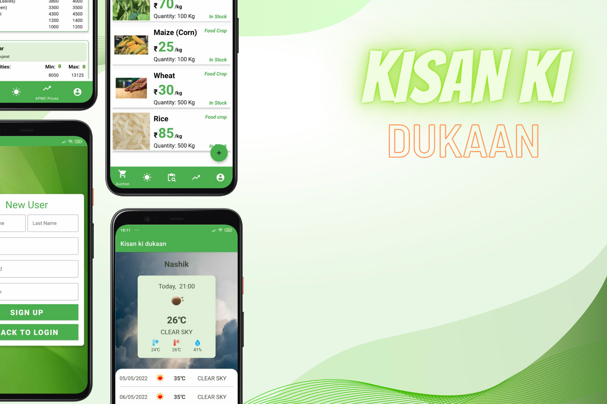
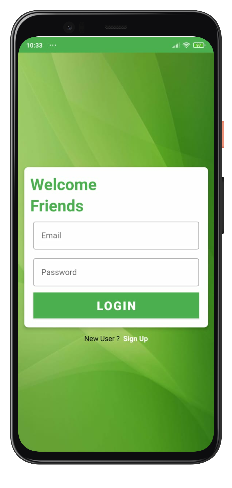
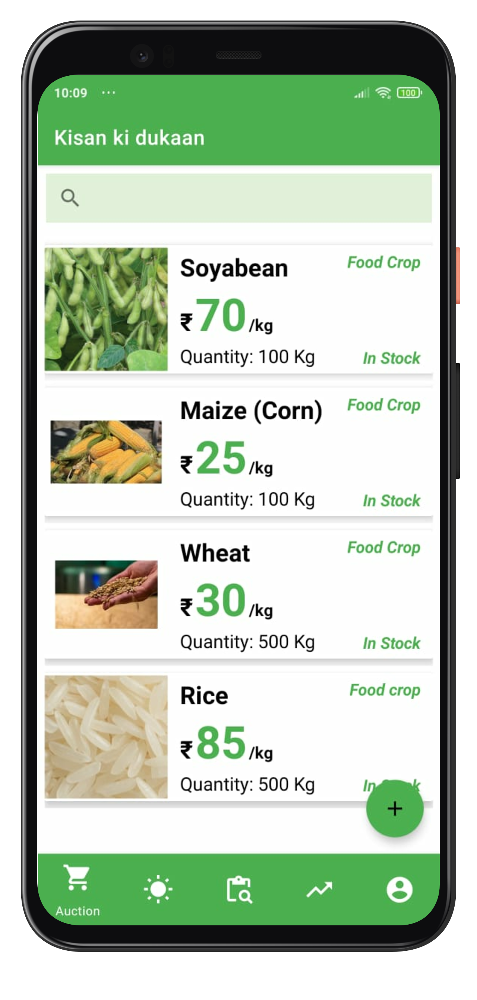
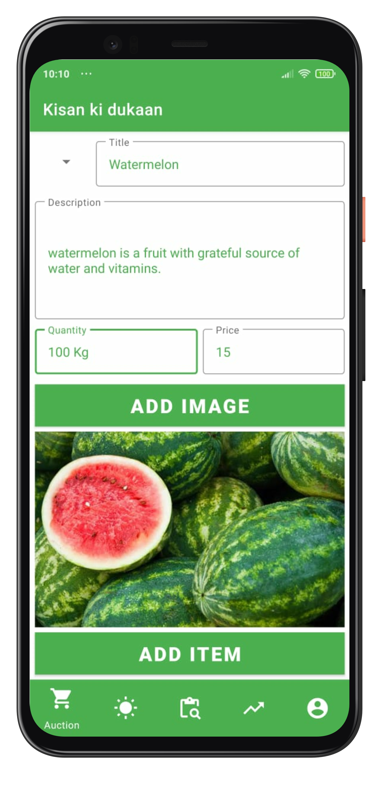
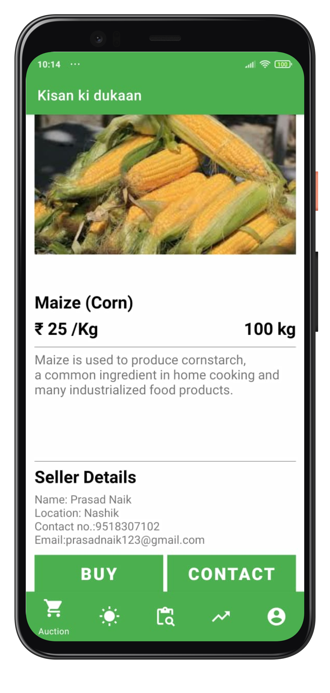
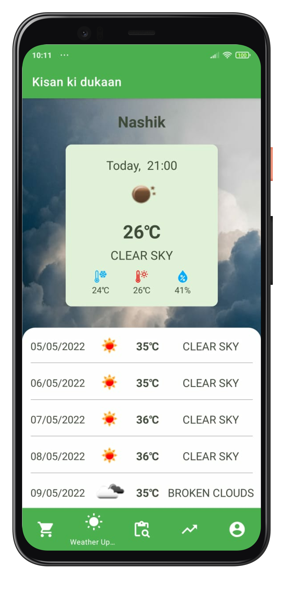
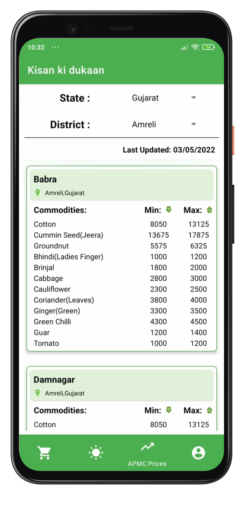
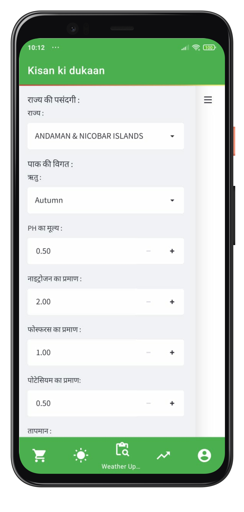
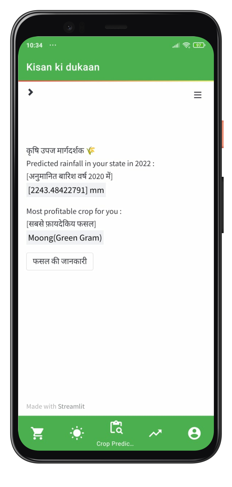

# Kisan Ki Dukan - One stop application for Indian Farmers

This is an Android Application designed for our Indian farmers.The technology has become a part and parcel of everyone's life and it is also helping us to make our daily tasks easy.
We identified that in the Agriculture sector, the farmers are still lacking the best technology use cases.
The main reason for creating this application was to combine every possible feature into the single app. This will remove the burden of managing multiple account and apps for farmers.
The application is also designed in such a way that it will be easy to use.

## Features

- E-commerce Platform
- Daily APMC Price Updates
- Community Network (Social Media)
- Weather Forecastin

## Technologies / Tools used for building this app includes

| Android Studio | Firebase | Kotlin | External APIs | Android OS |
| --- | --- | --- | --- | --- |

## Designs

&nbsp;&nbsp;&nbsp;&nbsp;&nbsp;&nbsp;&nbsp;      

&nbsp;&nbsp;&nbsp;&nbsp;&nbsp;&nbsp;&nbsp;      &nbsp;&nbsp;&nbsp;&nbsp;&nbsp;&nbsp;&nbsp;          

&nbsp;&nbsp;&nbsp;&nbsp;&nbsp;&nbsp;&nbsp;      

&nbsp;&nbsp;&nbsp;&nbsp;&nbsp;&nbsp;&nbsp;      

## 😀 If you liked the app, Please give it a ⭐ and fork the repository. 🤚🏻
